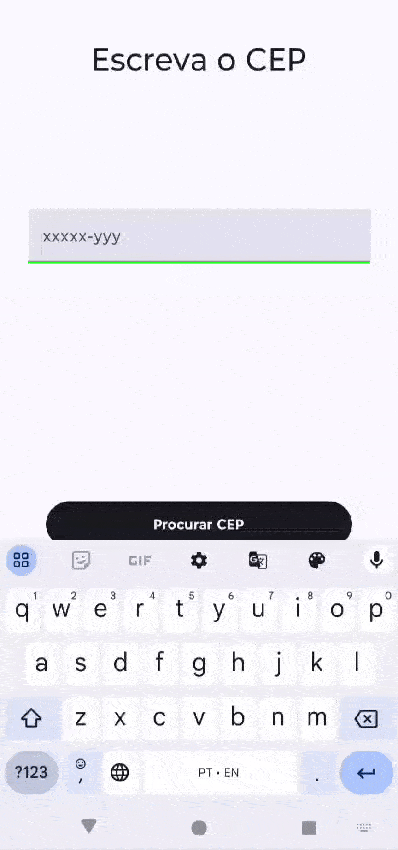

# Projeto CEP Checker
Aplicativo Android que busca encontrar informações do endereço através do *CEP*

### Siglas
*CEP* —  Código de Endereçamento Postal 
*PDM* —  Programação para Dispositivos Móveis  

## Descrição
Este é um projeto Android utilizando Jetpack Compose e Retrofit para consultar a API do [ViaCEP](https://viacep.com.br/) e retornar os dados de endereço de um CEP informado.

## Funcionalidades

- Validação do CEP informado.
- Consulta de endereço via CEP através da API do ViaCEP.
- Exibição dos dados de endereço.

## Tecnologias Utilizadas

- **Kotlin**: Linguagem principal do projeto.
- **Jetpack Compose**: Framework moderno para criação de interfaces de usuário no Android.
- **Retrofit**: Biblioteca para requisições HTTP.
- **Coroutines**: Para o gerenciamento de threads assíncronas.
- **Material Design**: Utilizado para a interface gráfica.
- **[ViaCEP](https://viacep.com.br/) **: API para consulta de endereços por meio do CEP.

## Instalação e Configuração

1. Clone este repositório:

    ```bash
    git clone https://github.com/HanielCostaDaSilva/CEP-Search-Kotlin.git
    ```

2. Abra o projeto no Android Studio.

3. Instale as dependências do projeto no `build.gradle` (dependências de Retrofit e Compose já devem estar configuradas).

## Exemplo de Uso

1. O usuário insere o CEP no campo de texto e clica no botão "Procurar CEP".
2. Em seguida, o endereço resultado do CEP será mostrado.



## Dependências

```gradle
dependencies {
    // Jetpack Compose
    implementation "androidx.compose.ui:ui:1.0.0"
    implementation "androidx.compose.material:material:1.0.0"
    implementation "androidx.compose.ui:ui-tooling:1.0.0"
    
    // Retrofit
    implementation 'com.squareup.retrofit2:retrofit:2.9.0'
    implementation 'com.squareup.retrofit2:converter-gson:2.9.0'
    
    // Coroutines
    implementation 'org.jetbrains.kotlinx:kotlinx-coroutines-core:1.5.0'
    implementation 'org.jetbrains.kotlinx:kotlinx-coroutines-android:1.5.0'
}

```
## Conclusões Finais
- Este projeto foi realizado como atividade avaliativa da disciplina de PDM, pelo professor [Gustavo Wagner](https://github.com/gugawag). 
- A criação do GIF foi através da ferramaneta online [ezgif](https://ezgif.com/)

- _Nota do Dev: foi uma ativade meio complicada, mas com a prática vem a perfeição_